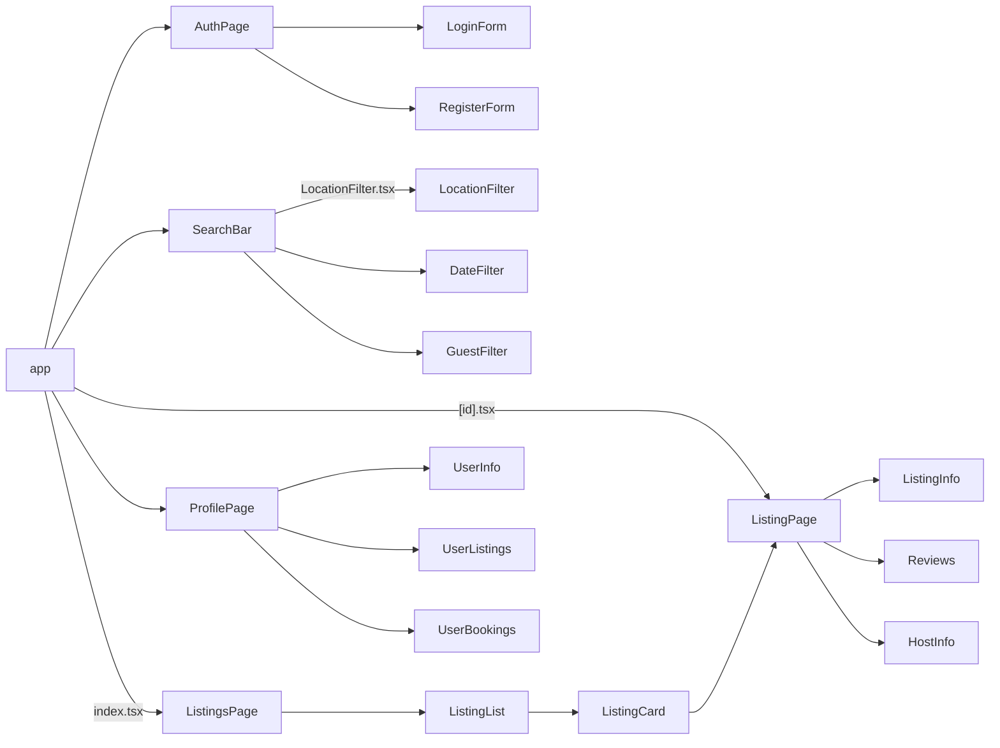

# Sharebnb

A place to find and share amazing outdoor spaces.

## Setup

Run development server:

```bash
npm run dev
```

## TODO

- [ ] Add script to generate listing & user data to populate DB
- [ ] Message notifications page

## Component Tree



## File Tree

```bash
.
├── app
│   ├── index.tsx              // Corresponds to ListingsPage
│   ├── login.tsx              // Corresponds to LoginPage
│   ├── register.tsx           // Corresponds to RegisterPage
│   ├── profile.tsx            // Corresponds to UserProfilePage
│   ├── [id].tsx               // Dynamic route for individual listings
│   ├── booking.tsx            // Corresponds to BookingPage
│   └── messages.tsx           // Corresponds to MessagesPage
├── components
│   ├── SearchBar
│   │   ├── index.tsx
│   │   ├── LocationFilter.tsx
│   │   ├── DateFilter.tsx
│   │   └── GuestFilter.tsx
│   ├── user
│   │   ├── UserInfo.tsx
│   │   ├── UserListings.tsx
│   │   └── UserBookings.tsx
│   ├── listing
│   │   ├── ListingInfo.tsx
│   │   ├── Reviews.tsx
│   │   └── HostInfo.tsx
│   ├── listings
│   │   ├── ListingList.tsx
│   │   └── ListingItem.tsx
│   ├── forms
│   │   ├── LoginForm.tsx
│   │   ├── RegisterForm.tsx
│   │   └── BookingForm.tsx
│   ├── payment
│   │   └── PaymentInfo.tsx
│   ├── messages
│   │   ├── MessageList.tsx
│   │   └── MessageItem.tsx
│   └── common
│       └── BookButton.tsx
├── lib
│   └── api.tsx                // API functions
├── styles
│   ├── globals.css            // Global styles
│   └── theme.tsx              // Theme-related styles
└── public
    ├── images                // Images used in the app
    └── favicon.ico           // Favicon

```

This is a [Next.js](https://nextjs.org/) project bootstrapped with [`create-next-app`](https://github.com/vercel/next.tsx/tree/canary/packages/create-next-app).